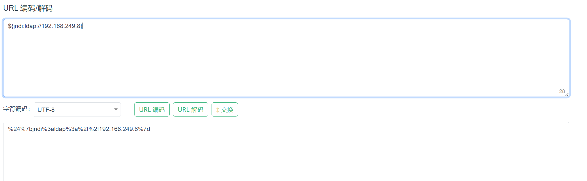

# log4j2漏洞复现环境搭建

## 镜像下载

在镜像管理中搜索`log4j`，选择`log4j`镜像下载。

在首页能够看到相关镜像的启动

## 启动镜像

启动镜像后，访问随机提供的端口（端口存在时间有限）可以进入能够进行注入的漏洞页面

点击`????？`会出现ok字样，同时在url栏出现payload，这显示存在注入的功能

## 测试漏洞

构建payload url指定IP为攻击者主机的ip，测试在页面输入payload是否可以执行命令

抓包

Flag[S]和Flag[R]表明试图连接的时候立即被拒绝，很明显，攻击机是存在访问靶机的行为，能够存在可以利用构造执行命令
