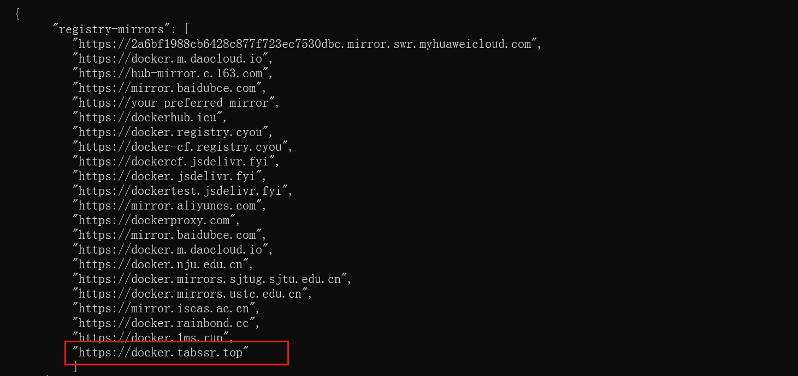
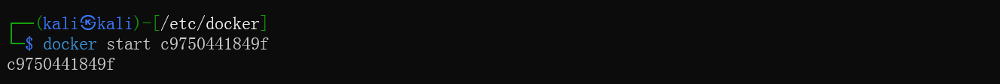
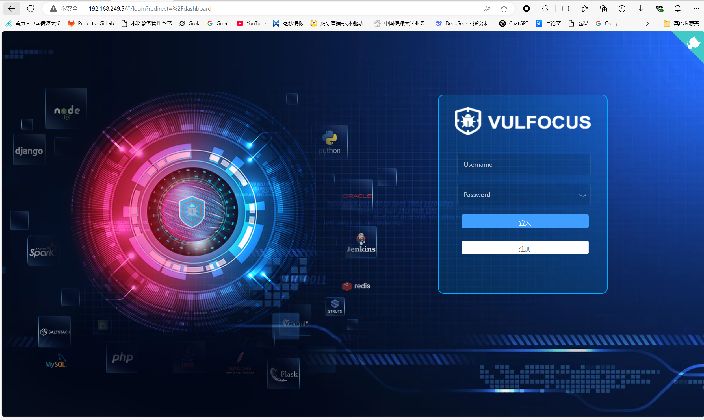

# vulfocus环境搭建

攻击机kali linux(192.168.249.8)
靶机kali linux(192.168.249.5)

## 拉取镜像

拉取镜像中需要配置相关的镜像加速器，这里使用的是课上提供的镜像

因为之前拉取过镜像，现在显示已是最新版本

## 启动容器

使用`docker images/images`查看相关的镜像ID和名称

通过指令`docker run -d -p 80:80 --name vulfocus vulfocus/vulfocus`将拉取的镜像创建容器

启动容器`docker start container_id`

成功在web端访问靶场，账号密码均为admin，成功登录

